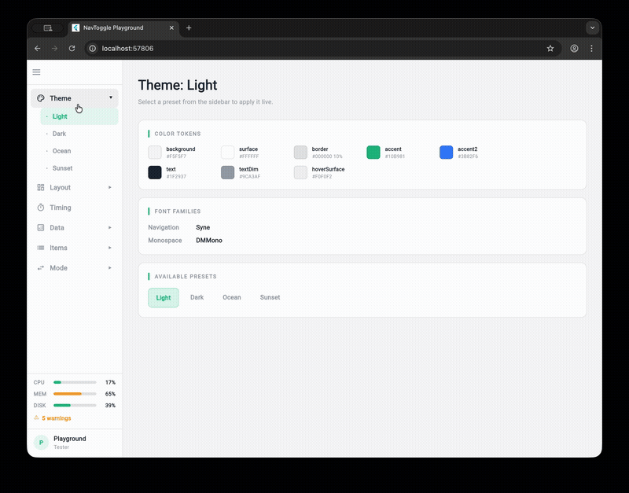

# flutter_nav_toggle

A dual-mode navigation widget for Flutter that smoothly morphs between **sidebar** and **tab bar** layouts with clip-path animations.



## Features

- **Sidebar mode** — vertical panel with expandable/collapsible hierarchical items, status panel, and user info
- **Tab bar mode** — horizontal bar with overlay dropdowns, compact status chips, and user avatar
- **Morphing toggle button** — cursor-tracking directional arrows with hamburger-to-arrow icon morph, powered by `flutter_morphing_button`
- **Animated transitions** — phased collapse → expand driven by a single `AnimationController`
- **4 built-in themes** — Light, Dark, Ocean, Sunset (or build your own with `NavToggleTheme.copyWith`)
- **Fully configurable** — dimensions, durations, easing curves, colors, fonts, border radii
- **Accessibility** — respects `MediaQuery.disableAnimations`

## Quick Start

```dart
import 'package:flutter_nav_toggle/flutter_nav_toggle.dart';

NavToggleScaffold(
  items: [
    NavItem(id: 'home', label: 'Home', icon: Icons.home_outlined),
    NavItem(id: 'settings', label: 'Settings', icon: Icons.settings_outlined),
  ],
  onItemSelected: (id) => print('Selected: $id'),
  child: Center(child: Text('Content')),
)
```

## Hierarchical Items

```dart
NavItem(
  id: 'products',
  label: 'Products',
  icon: Icons.inventory_outlined,
  children: [
    NavItem(id: 'electronics', label: 'Electronics', icon: Icons.devices_outlined),
    NavItem(id: 'clothing', label: 'Clothing', icon: Icons.checkroom_outlined),
  ],
)
```

Parents expand/collapse in sidebar mode and open overlay dropdowns in tab bar mode.

## Theming

```dart
// Use a built-in preset
NavToggleScaffold(
  theme: const NavToggleTheme.ocean(),
  // ...
)

// Or customize
NavToggleScaffold(
  theme: const NavToggleTheme.dark().copyWith(
    sidebarWidth: 260,
    accent: Color(0xFFFF6B6B),
    collapseDuration: Duration(milliseconds: 300),
  ),
  // ...
)
```

Available presets: `NavToggleTheme()` (light), `.dark()`, `.ocean()`, `.sunset()`

## System Status & User Info

```dart
NavToggleScaffold(
  systemStatus: SystemStatus(cpu: 0.42, memory: 0.67, disk: 0.55, warnings: 3),
  userInfo: UserInfo(name: 'Alice', role: 'Admin'),
  // ...
)
```

Status displays as progress bars (sidebar) or compact chips (tab bar). User info shows as an avatar panel (sidebar) or chip (tab bar).

## Run the Playground

```bash
cd example
flutter run -d chrome
```

The example app is an interactive playground that lets you tweak every property live.
